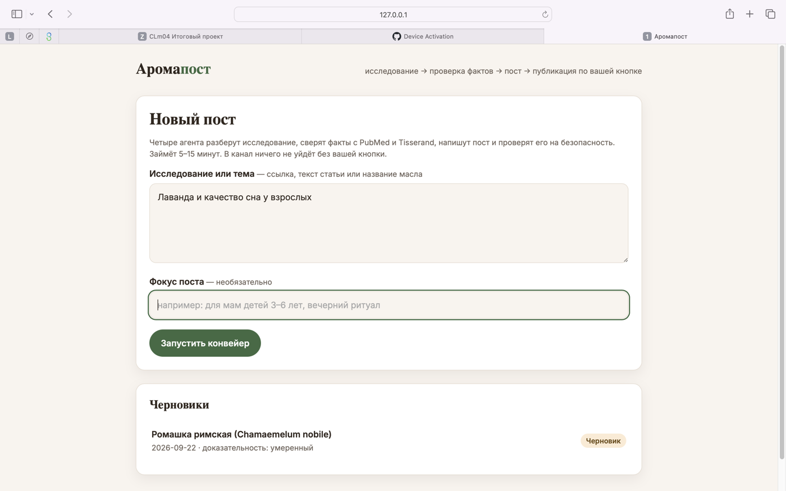
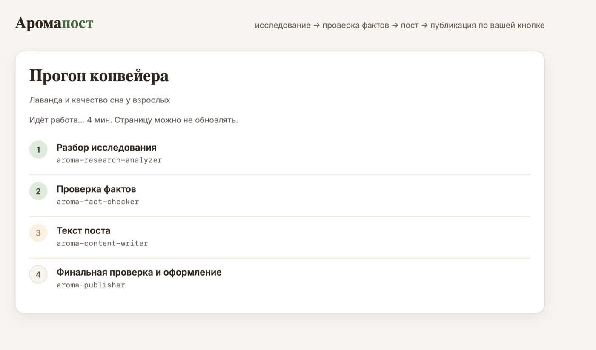
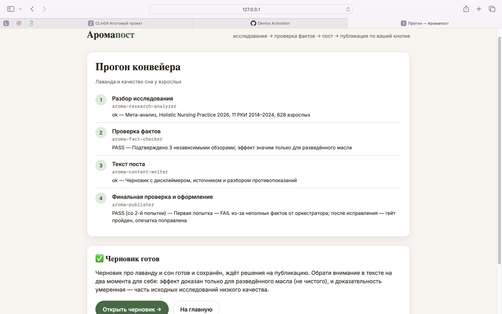
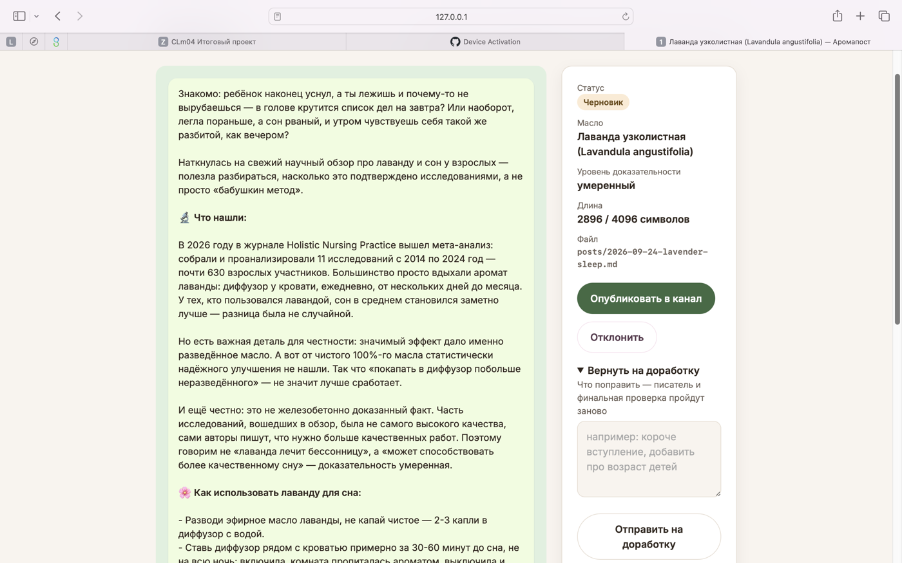
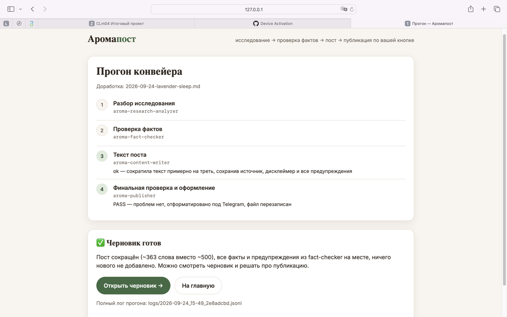
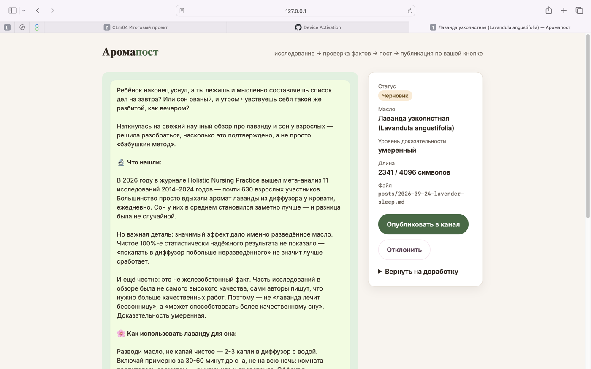

# Аромапост — контент-конвейер с проверкой фактов

Локальный веб-сервис, который превращает научное исследование об эфирных маслах в готовый пост для Telegram: с проверенными фактами, уровнем доказательности, противопоказаниями и источником. Публикация — только по кнопке автора.

Работает на [Claude Code](https://claude.com/claude-code) по подписке (Pro или выше), без отдельного API-ключа.



## Проблема

Я веду Telegram-канал об ароматерапии для мам 25–35 лет. Один пост с опорой на науку занимал 3–4 часа: найти исследование на PubMed, сверить с Tisserand, проверить безопасность для детей, написать живым языком, оформить. В теме здоровья ошибка стоит дорого: мятное масло детям до 6 лет или неразбавленное масло на коже — реальный вред.

Без системы канал выгорел: писать долго, проверять страшно.

## Решение

Автор вставляет ссылку на исследование или название масла — четыре ИИ-агента по очереди делают работу редакции:

| Шаг | Агент | Что делает |
|---|---|---|
| 1 | `aroma-research-analyzer` | Извлекает факты, дизайн исследования, выборку, ограничения |
| 2 | `aroma-fact-checker` | Сверяет с PubMed, Tisserand, NAHA; выносит уровень доказательности и противопоказания. **Гейт:** если факт не подтвердился — конвейер останавливается |
| 3 | `aroma-content-writer` | Пишет пост в тоне канала — без обещаний лечения, с источником и дисклеймером |
| 4 | `aroma-publisher` | Финальный гейт: каждое утверждение сверяется с проверенными фактами, каждое противопоказание — поштучно. Оформляет под Telegram |

Правила ниши вынесены в скиллы (`.claude/skills/`): источники, безопасность, этика, критерии доказательности, тон, оформление.

Страница показывает, какой агент работает сейчас:



А в конце — вердикт каждого шага. Здесь финальный гейт с первой попытки вернул FAIL (писателю передали неполный набор фактов), конвейер сам исправил и прошёл проверку со второй:



Автор видит пост так, как он будет выглядеть в канале, и решает: **опубликовать**, **вернуть на доработку** с замечанием или **отклонить**.



При доработке факты заново не проверяются — переписывает писатель, и текст снова проходит финальный гейт. Замечание «сократить» — пост стал короче на треть, все предупреждения на месте:





## Результат

- **3–4 часа → 15 минут** на пост: автор проверяет готовый черновик, а не пишет с нуля.
- **Первый прогон через интерфейс** («Лаванда и качество сна у взрослых»): ~10 минут до готового черновика, доработка — ~3 минуты. Агент нашёл мета-анализ 2026 года (11 РКИ, 628 участников), проверка подтвердила его тремя независимыми обзорами, DOI источника реальный.
- **Ошибки ловятся до публикации.** В тестовых прогонах гейты остановили пост про эвкалипт (не сложился в цельную историю) и дважды вернули пост про ромашку на доработку (детская дозировка, смешение исследованного и бытового применения).
- **Каждый пост — с источником и честным уровнем доказательности.**
- **Безопасно:** агентам запрещены команды терминала — они физически не могут ничего отправить. В канал уходит только то, что автор подтвердил кнопкой.
- **Прозрачно:** полный лог каждого прогона сохраняется в `logs/`.

## Запуск

Нужно: macOS/Linux, Python 3.10+, [Claude Code](https://claude.com/claude-code) с выполненным входом (подписка Pro или выше).

```bash
git clone https://github.com/pestovads-alt/aroma-content-pipeline.git
cd aroma-content-pipeline
python3 -m venv .venv
.venv/bin/pip install -r requirements.txt
cp .env.example .env        # токен бота и id канала — для кнопки «Опубликовать»
.venv/bin/python app.py
```

Откройте http://127.0.0.1:5050.

Чтобы посмотреть интерфейс без затрат лимита, скопируйте пример: `cp examples/*.md posts/`.

**Проще через Claude Code:** откройте папку в `claude` и напишите «разверни проект» — скилл `aromapost-setup` проведёт по шагам, включая настройку бота.

## Сценарий пользователя

1. Вставить ссылку на исследование или название масла, при желании — фокус поста («для мам детей 3–6 лет»).
2. Нажать «Запустить конвейер» и наблюдать, какой агент работает (5–15 минут).
3. Прочитать черновик в превью Telegram, посмотреть уровень доказательности.
4. Опубликовать / вернуть на доработку с замечанием / отклонить.

## Адаптация под свою нишу

Конвейер подходит любому эксперту, у которого ошибка в посте — риск для читателя: нутрициология, психология, фитнес, косметология. Код менять не нужно — замените правила в `.claude/skills/` (источники, безопасность, тон). Скилл `aromapost-setup` пройдёт по ним вместе с вами.

## Структура

```
app.py                 веб-интерфейс (Flask)
pipeline.py            запуск конвейера через claude -p, прогресс по шагам
telegram_publish.py    публикация через Telegram Bot API
templates/, static/    страницы и стили
.claude/agents/        4 агента конвейера
.claude/skills/        правила ниши + скилл установки aromapost-setup
examples/              примеры готовых постов (ромашка, лаванда)
docs/screenshots/      скриншоты для README
posts/                 черновики (не в git)
logs/                  логи прогонов (не в git)
```

## Технологии

Python 3, Flask, HTML/CSS/JS · Claude Code (headless-режим, субагенты, скиллы, модель Sonnet) · Telegram Bot API.

## Дальше

- Экран контент-плана: темы на месяц из уже проверенной базы знаний.
- Картинка к посту по шаблонам канала.
- Выгрузка проверенных фактов в базу знаний.

---

Финальный проект курса по Claude Code. Автор — Дарья Пестова, канал «Аромамама|Ресурс».
